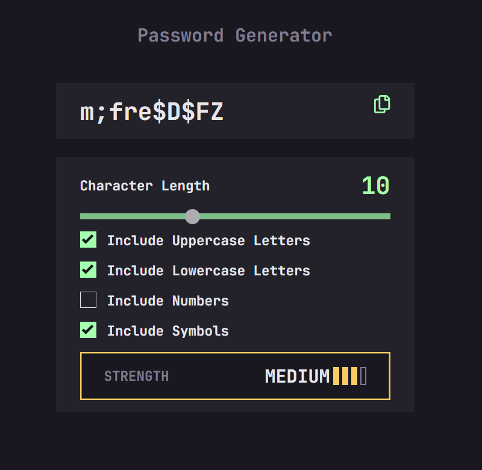

# Frontend Mentor - Password generator app solution

This is a solution to the [Password generator app challenge on Frontend Mentor](https://www.frontendmentor.io/challenges/password-generator-app-Mr8CLycqjh). Frontend Mentor challenges help you improve your coding skills by building realistic projects. 

## Table of contents

- [Overview](#overview)
  - [The challenge](#the-challenge)
  - [Screenshot](#screenshot)
  - [Links](#links)
- [My process](#my-process)
  - [Built with](#built-with)
  - [What I learned](#what-i-learned)
  - [Continued development](#continued-development)
  - [Useful resources](#useful-resources)
- [Author](#author)
- [Acknowledgments](#acknowledgments)

**Note: Delete this note and update the table of contents based on what sections you keep.**

## Overview

### The challenge

Users should be able to:

- Generate a password based on the selected inclusion options
- Copy the generated password to the computer's clipboard
- See a strength rating for their generated password
- View the optimal layout for the interface depending on their device's screen size
- See hover and focus states for all interactive elements on the page

### Screenshot

### Links

- Solution URL: [Add solution URL here](https://your-solution-url.com)
- Live Site URL: [https://jonatan-samuelsson.github.io/password-generator-app/](https://jonatan-samuelsson.github.io/password-generator-app/)

## My process

### Built with

- Semantic HTML5 markup
- CSS custom properties
- Flexbox
- CSS Grid
- Mobile-first workflow
- JavaScript

### What I learned

This is the project were I felt a lot of JS stuff came together for me, particularly with regards to QuerySelector, naming and clean DRY code / compartmentalized logic. 

I'm also happy about my desicion to omit the generate-button, as the dynamic generation made it obsolete. 

Finally, I liked my idea of adjusting the max length of the password accoring to screen size to avoid overflow while still utilizing the increased space available at bigger sizes.

### Continued development

Going forward, I would like to make even cleaner JS logic. Also, as the codebases grow, practicing annotating with comments to clarify for others becomes increasingly important.

### Useful resources

- [MindpointGroup on password strength](https://www.mindpointgroup.com/blog/password-strength-and-complexity) - Here I found the entropy equation for calculating password strength
- [MDN](https://developer.mozilla.org/en-US/) - I used lots of MDN articles to get stuff right.
- [W3schools](https://www.w3schools.com/) - I used lots of W3 articles as well, particularly for styling range slider and copying to clipboard w/ JS.

## Author

- Website - [Jonatan Samuelsson](https://jontesamuelsson.se)
- Frontend Mentor - [@jonatan-samuelsson](https://www.frontendmentor.io/profile/jonatan-samuelsson)

## Acknowledgments

[ChatGPT](https://chatgpt.com/) - Always a good companion for troubleshooting
